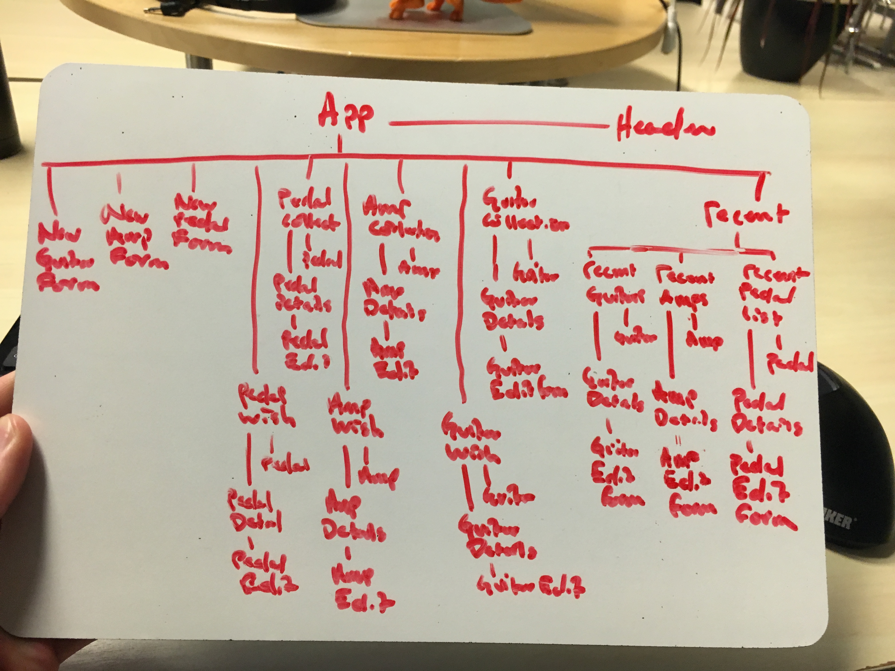

# Epicodus Capstone guitarList plan

#### An app that allows users to add and update musical gear to a personal collection (_This is an Epicodus exercise that is a work in progress_)

#### By _**Matt Miller**_

## Project Description
<strong>Name of Project:</strong> guitarList (working title)<br>

<strong>Project’s Purpose or Goal:</strong> CRUD app that allows user to manage current inventory and wishlist of musical equipment (specifically guitars, basses, amps, and pedals)<br>

<strong>Minimum features the project requires to meet this purpose or goal:</strong><br>

   * Display list of current items in inventory<br>
   * Click on item to see details<br>
   * Add new item to inventory<br>
   * Edit details of an item<br>
   * Delete item from inventory<br>

<strong>Tools, frameworks, libraries, APIs, modules and/or other resources used to create this MVP:<strong><br>

   * Custom Java RESTful API<br>
   * React<br>
   * React Redux<br>

Stretch goals:<br>
   * Add notes to instrument<br>
   * Add guitar type to guitars<br>
   * Filter inventory by type<br>
   * Search inventory by query<br>
   * Create multiple accounts<br>

## Relevant Repositories

* React Frontend:
https://github.com/mattfmiller/guitarList

* Custom Java API (multiple branches): https://github.com/mattfmiller/equiplist


#### User Story

A. As a user, I want to see recent instruments in the collection (get guitars in collection, get amps in collection, get pedals in collection)<br>
B. As a user, I want to see all guitars in the collection (get guitars in collection)<br>
C. As a user, I want to see all amps in the collection (get amps in collection) <br>
D. As a user, I want to see all pedals in the collection (get pedals in collection) <br>
E. As a user, I want to see specific information about a single guitar (get guitar in collection or wishlist)<br>
F. As a user, I want to see specific information about a single amp (get amp in collection or wishlist)<br>
G. As a user, I want to see specific information about a single pedal (get pedal in collection or wishlist)<br>
H. As a user, I want to be able to add a guitar to the database (post guitar)<br>
I. As a user, I want to be able to add an amp to the database (post amp)<br>
J. As a user, I want to be able to add a pedal to the database (post pedal)<br>
K. As a user, I want to see which guitar type(s) a single guitar is associated with (get guitarTypes by guitar id)<br>
L. As a user, I want to be able to add a guitar type to a guitar (post guitarType by guitar id)<br>
M. As a user, I want to see all guitars of a specific guitar type (get guitars by guitarType id)<br>
N. As a user, I want to be able to add a note on an instrument (post note by instrument id)<br>
O. As a user, I want to see all notes for an instrument (get notes by instrument id)<br>
P. As a user, I want to edit instrument details when they change (Post update guitar, post update amp, post, update pedal)<br>
Q. As a user, I want to delete instruments when they are no longer in my collection or wantlist (post delete guitar, post delete amp, post delete pedal).
R. As a user, I want to delete notes that are no longer relevant (post delete note)<br>
S. As a user, I want to delete a guitar type association in case of error (post delete guitarType)<br>

## Design

Component Tree:


Landing Page:


Instrument Details:


Sate Structure:
```
{
  guitarsInCollection: [],
  ampsInCollection: [],
  pedalsInCollection: [],
  guitarsInWishlist: [],
  ampsInWishlist: [],
  pedalsInWishlist: [],
  selectedInstrumentId: null,
  selectedInstrumentNotes:[],
  selectedGuitarTypes: []
}
```

## Known Bugs

* N/A

## Support and contact details

For support, contact: matt.f.miller@live.com

## Technologies Used

* Java
* SQL Database
* JavaScript
* React

### License

This software is licensed under the GPL license.

Copyright © 2018 **Matt Miller**
