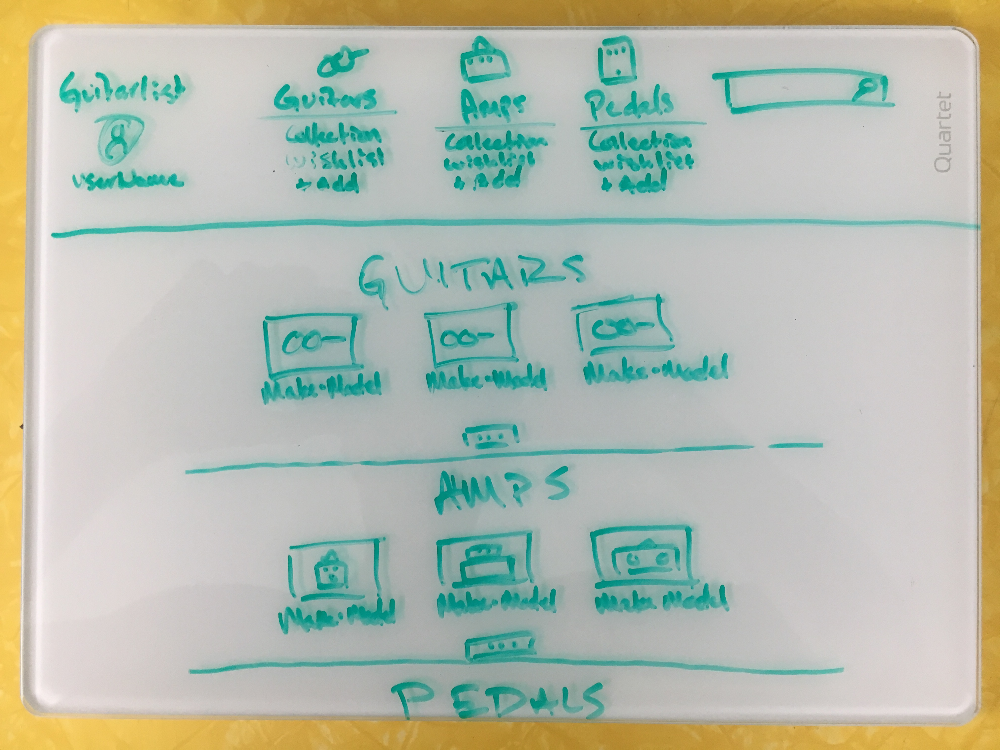
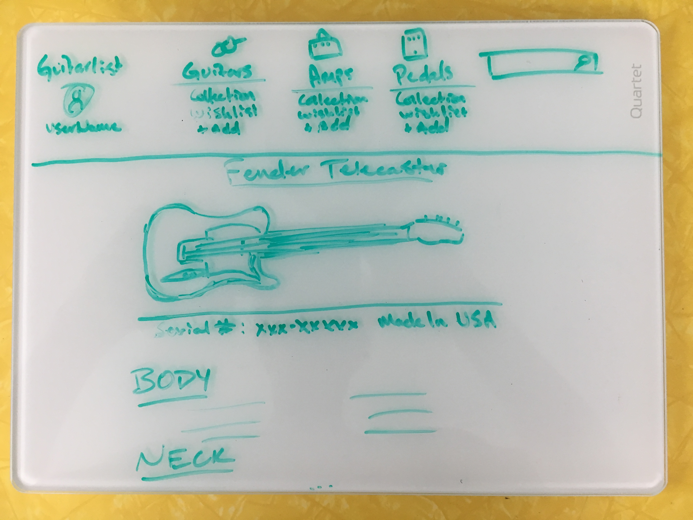

# Epicodus Capstone guitarList plan

#### An app that allows users to add and update musical gear to a personal collection (_This is an Epicodus exercise that is a work in progress_)

#### By _**Matt Miller**_

## Project Description
<strong>Name of Project:</strong> guitarList (working title) 

<strong>Project’s Purpose or Goal:</strong> CRUD app that allows user to manage current inventory and wishlist of musical equipment (specifically guitars, basses, amps, and pedals) 

<strong>Minimum features the project requires to meet this purpose or goal:</strong> 

   * Display list of current items in inventory 
   * Click on item to see details 
   * Add new item to inventory 
   * Edit details of an item 
   * Delete item from inventory 

<strong>Tools, frameworks, libraries, APIs, modules and/or other resources used to create this MVP:<strong> 

   * Custom Java API 
   * React 
   * React Redux 

Stretch goals: 

   * Filter inventory by type 
   * Search inventory by query 
   * Create multiple accounts 

## Relevant Repositories

* Custom Java API (multiple branches): https://github.com/mattfmiller/equiplist

#### User Story

A. As a user, I want to see all instruments in the collection  
B. As a user, I want to see all guitars in the collection  
C. As a user, I want to see all amps in the collection  
D. As a user, I want to see all pedals in the collection  
E. As a user, I want to see specific information about a single guitar 
F. As a user, I want to see specific information about a single amp 
G. As a user, I want to see specific information about a single pedal 
H. As a user, I want to be able to add a guitar to the database 
I. As a user, I want to be able to add an amp to the database 
J. As a user, I want to be able to add a pedal to the database 
K. As a user, I want to see which guitar type(s) a single guitar is associated with 
L. As a user, I want to be able to add a guitar type to a guitar 
M. As a user, I want to see all guitars of a specific guitar type 
N. As a user, I want to be able to add a note on an instrument 
O. As a user, I want to see all notes for an instrument 
P. As a user, I want to edit instrument details when they change 
Q. As a user, I want to delete instruments when they are no longer in my collection or wantlist.
R. As a user, I want to delete notes that are no longer relevant 
S. As a user, I want to delete a guitar type association in case of error 

## Design

Landing Page:

Instrument Details:

## Known Bugs

* N/A

## Support and contact details

For support, contact: matt.f.miller@live.com

## Technologies Used

* Java
* SQL Database
* JavaScript
* React

### License

This software is licensed under the GPL license.

Copyright © 2018 **Matt Miller**
